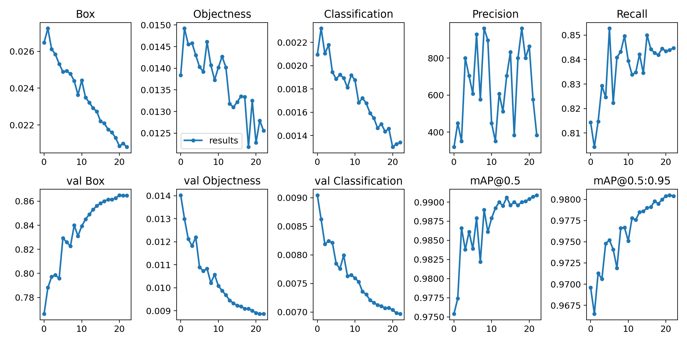

# 训练结果说明

- **训练轮次（Epochs）**：模型进行了24轮训练，这是一个典型的训练轮次数。

- **训练损失（Train Loss）**：从0.02648降低到0.0208，说明模型在训练集上的表现有所提升。

- **验证损失（Val Loss）**：从0.05297降低到0.04202，说明模型在验证集上的表现也有所提升。

- **精确度（Precision）**：从0.8144提升到0.8447，说明模型对正样本的识别能力有所提升。

- **召回率（Recall）**：从0.9754提升到0.9909，说明模型对正样本的覆盖能力有所提升。

- **平均精度均值（mAP）**：从0.7664提升到0.8648，说明模型的整体性能有所提升。
