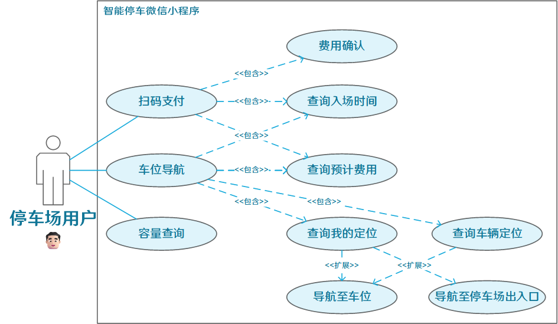

# 智能停车场管理系统开发

* 摘要
* 目录

[TOC]

## 引言

## 1 综述

### 1.1 研究背景及其重要性

#### 1.1.1 社会背景

自改革开放以来，我国汽车产业的飞速发展，特别是国产新能源汽车的崛起，使得汽车不再是遥不可及的进口奢侈品，而是转变为经济适用、质量上乘的国产高端商品。随着人们收入水平的稳定提升和生活品质的持续改进，越来越多的家庭有能力购买汽车，汽车已经深入到了普通家庭。汽车的普及率持续攀升，这意味着城市中的汽车数量在不断增长，从而带来了停车需求的增加。这一变化反映了我国社会经济的快速发展和人民生活水平的提高。

尽管汽车数量和停车场数量都在增长，但停车位的供应仍然无法满足停车的需求。根据国家发改委公布的数据，目前我国的停车需求接近3亿，大城市的小汽车与停车位的比例约为1:0.8，中小城市约为1:0.5，而发达国家约为1:1.3。

表格 1.1 2014年至2022年停车位数量与汽车保有量数据

| **年份**           | **2014** | **2015** | **2016** | **2017** | **2018** | **2019** | **2020** | **2021** | **2022** |
| :----------------- | :------- | :------- | :------- | :------- | :------- | :------- | :------- | :------- | :------- |
| **停车位数量**     | 6598     | 6935     | 7890     | 8920     | 10150    | 11500    | 12900    | 14500    | 16885    |
| **全国汽车保有量** | 15400    | 17200    | 19400    | 21700    | 24000    | 26000    | 28100    | 30200    | 31900    |
| **缺口**           | 8802     | 10265    | 11510    | 12780    | 13850    | 14500    | 15200    | 15700    | 15015    |

根据公安部政府网站的数据，截至2023年9月底，全国机动车达4.3亿辆，驾驶人达5.2亿人，新能源汽车保有量达1821万辆。2023年一至三季度，全国新注册登记汽车1817万辆，同比增长4.4%，一季度、二季度、三季度新注册登记汽车分别为588万辆、587万辆、642万辆。

然而，全国汽车拥有量的逐年增加也带来了严重的停车难题。驾驶员常常难以找到合适的停车位，使得停车变得异常困难。此外，当人们在公共场所完成购物、聚会等活动后，由于遗忘了停车位信息，往往难以找到自己的车辆，甚至在找到车辆后也难以找到出口。传统的停车场管理模式依赖人工操作，效率低下、易出错，无法满足大型停车场的管理需求。作为城市交通管理的关键组成部分，停车场当前面临着一系列的问题和挑战。

#### 1.1.2 技术背景

随着移动互联网的广泛应用以及大数据、物联网、云服务等先进技术的深入应用，智慧停车逐渐成为新型城市的标配，传统停车场也在向智慧化、数字化方向转变。智慧停车系统有助于改善局部交通微循环、减缓交通拥堵，提供更优质的停车服务，为城市智慧交通和智慧城市的建设提供助力。

#### 1.1.3 重要性

随着我国汽车产业的飞速发展和汽车保有量的逐年增加，停车问题已经成为了影响城市交通、环境和居民生活质量的重要因素。传统的停车场管理模式已经无法满足当前的停车需求，而智慧停车作为一种新型的停车解决方案，能够有效地解决停车难题，提高停车效率，减少交通拥堵，提升城市交通管理水平，对于推动我国城市的智慧化建设具有重要的意义。因此，对智慧停车的研究具有重要的理论和实践价值。这不仅可以推动我国城市的智慧化建设，也可以为全球其他城市提供参考和借鉴，推动全球城市的智慧化发展。这是一项具有深远影响和广泛应用前景的研究。

### 1.2 国内外智能停车场管理系统的研究现状

智能停车场管理系统的研究涵盖了多个关键领域，包括车辆进出停车场的流程、车主寻找车位的过程，以及停车场管理和用户应用的体验。在这些领域中，车牌识别技术和车位监测技术是至关重要的。

#### 1.2.1 车牌识别技术

#### 1.2.2 车位检测技术

#### 1.2.3 停车场管理与用户软件

### 1.3 毕业设计的主要工作

## 2 相关理论与技术基础

### 2.1 深度学习与数字图像处理基础

#### 2.1.1 YOLOv5 目标检测算法

YOLOv5是YOLO（You Only Look Once）系列的最新发展，是一种目标检测算法。YOLO系列以其快速、高效的特点而广受好评，能够在一张图像中同时检测出多个目标，并且在实时应用中表现良好。相较于之前的版本，YOLOv5由ultralytics团队开发，对模型结构、性能和速度都进行了改进。

YOLOv5的设计理念是简化和优化，采用了PyTorch框架实现，使其易于使用和训练。在许多计算机视觉应用中，YOLOv5已经取得了良好的效果，包括物体检测、行人检测、交通标志检测等。

此外，YOLOv5-face是一种基于深度学习的人脸检测技术，其开源框架被许多开发者所使用。在该检测技术的基础上，一些开发者进行了修改，并开发出了用于检测车辆车牌的目标检测模型，该模型的源代码已经在GitHub上开放。

#### 2.1.2 OpenCV 计算机视觉库

OpenCV（Open Source Computer Vision Library）是一个开源的计算机视觉库，被广泛应用于图像处理、计算机视觉、机器学习等领域。它提供了丰富的功能和算法，涵盖了从基础的图像操作（如图像读取、保存、缩放、旋转等）到高级的计算机视觉任务（如目标检测、人脸识别、运动跟踪等）的各个方面。

在车牌识别这个场景中，使用OpenCV开源视觉库具有重要意义。由于车辆在行驶过程中角度不同，摄像头的位置和角度也会发生变化，导致拍摄到的车牌图像可能存在畸变。这种畸变可能会影响后续的车牌识别准确性。因此，通过OpenCV提供的图像处理功能，可以对拍摄到的车牌图像进行畸变校正，使其在角度上对齐，从而更好地输入到文本识别网络中进行处理。这样的预处理步骤有助于提高车牌识别系统的性能和准确性，使其更适用于实际应用场景。

#### 2.1.3 CRNN 文本识别网络

CRNN（Convolutional Recurrent Neural Network）是一种用于文本识别的深度学习模型，将卷积神经网络（CNN）和循环神经网络（RNN）相结合。这种模型能够有效地处理不定长度的序列数据，因此在场景文本识别、光学字符识别（OCR）等任务中得到了广泛应用。

CRNN文本识别网络主要用于识别输入车牌图像中的车牌号码，并将图像信息转换为文字信息。由于车牌号码的长度可能各不相同，因此采用不定长的序列识别方法相较于传统的文字切割再识别更为适用。CRNN网络能够直接从整张图像中提取并识别出车牌号码，从而简化了识别过程，并提高了识别的准确性和效率。

### 2.2嵌入式系统基础

#### 2.2.1 树莓派硬件平台及其操作系统

树莓派（Raspberry Pi）是一款低成本、高性能的单板计算机，广泛应用于教育、嵌入式开发、物联网和个人项目等领域。树莓派5是Raspberry Pi系列计算机中的新一代旗舰产品。与前代产品Raspberry Pi 4相比，它的CPU性能提高了2~3倍，GPU性能大幅提升，摄像头、显示功能和USB接口也得到了改进。

##### （1）硬件参数

###### 1. 处理器

 树莓派5采用了运行频率为2.4GHz的Broadcom最新推出的一款四核64位Arm Cortex-A76处理器：BCM2712。与树莓派4相比，CPU性能提高了2至3倍。此外，树莓派5还利用了内部构建的芯片RP1，为其提供了丰富的I/O（输入/输出）功能。

BCM2712采用了TSMC 16nm工艺，相较于其他同类型产品使用的TSMC 8nm工艺落后了两代。因此，在运行时必须使用足够大的散热片和散热风扇来保持良好的温度控制。此外，供电要求也提高到了5V 5A，相较于前代的5V 3A，要求更高。

###### 2. 数据接口

树莓派的一个显著特点是其顶部边缘的一排通用输入/输出（GPIO）引脚。目前市面上所有的树莓派型号都配备了一个40针的GPIO接口。在软件层面，可以自由地将任何一个GPIO引脚设置为输入或输出模式，以适应多样化的应用需求。这意味着您可以根据项目的具体需求，编程控制GPIO引脚来接收（作为输入）或发送（作为输出）信号，实现对各种电子元件的精确交互与控制。这一功能为树莓派提供了巨大的灵活性和扩展性，使其成为电子和编程爱好者的理想选择。

树莓派可以使用CSI 接口采集图像，CSI 接口是通过串行接口进行数据传输，数据传输快、支持500W 高分辨率图像数据、抗干信号扰能力强等优点。

##### （2）操作系统

树莓派OS（Raspbian OS）是一款基于Debian的免费操作系统，专门为树莓派硬件进行了优化，因此是在树莓派上正常使用的推荐操作系统。这个操作系统附带了超过35,000个软件包，这些软件包都以良好格式捆绑，并且已经进行了预编译，因此可以轻松地安装在树莓派上。树莓派OS内置了对摄像头的驱动支持，使得连接和使用摄像头变得非常简单。用户可以通过简单的配置和命令即可启用和操作树莓派摄像头。

#### 2.2.2 STM32 微控制器硬件平台

STM32是一系列由意法半导体（STMicroelectronics）公司推出的32位ARM Cortex-M微控制器系列的总称。这些微控制器被广泛用于各种嵌入式系统中，从简单的家用电器到复杂的工业自动化设备等等。作为STM32微控制器系列中的入门款芯片，STM32F1系列具有出色的性能和丰富的功能，是嵌入式系统开发中的重要组成部分。这些芯片通过GPIO、USART等端口可以连接各种传感器和外围设备，实现对外部环境的监测和控制。

笔者使用的STM32F103ZET6芯片拥有多达100个引脚，主频可达72MHz，拥有丰富的外设资源。借助这些功能，可以轻松地连接超声波传感器、网络通信模块等外部设备。除此之外，STM32F1系列还具备丰富的内置功能，如模数转换器（ADC）、定时器、PWM输出等，使得开发者可以在单一芯片上完成多种任务，提高了系统的整体性能和灵活性。

#### 2.2.3 MQTT 通信协议

MQTT（Message Queuing Telemetry Transport）是一种轻量级的、基于发布/订阅模式的通信协议，旨在连接各种设备，并使它们能够进行实时通信。MQTT的报文格式为简单且轻量，由固定头部和可选的可变头部以及有效载荷组成，其中：

1. **固定头部**：包含了控制报文类型、标志位和剩余长度字段，用于标识消息的类型和处理方式。
2. **可变头部**：根据不同的报文类型而可选，包含了一些可变的控制字段，用于指定特定消息的一些参数，如消息的质量等级（QoS）和保持连接的时间等。
3. **有效载荷**：包含了实际的消息内容，即要传输的数据。

通过这样的报文格式，MQTT实现了高效的通信，使得设备能够以低带宽和低计算成本进行连接，并且保持实时通信。这使得MQTT在物联网（IoT）和传感器网络等领域得到了广泛应用。

### 2.3 管理系统与用户软件

 #### 2.3.1 Qt 应用框架

Qt是一个跨平台的C++应用程序开发框架，由Qt公司于1995年首次发布。它提供了一套丰富的库和工具，用于开发图形用户界面（GUI）、网络应用、嵌入式应用和其他类型的软件。Qt的跨平台特性使得开发者可以轻松地编写一次代码，然后在多个平台上进行部署，包括Windows、macOS、Linux等。

基于Qt框架开发的应用可以满足各种需求，从简单的桌面软件到复杂的企业级应用都能实现。Qt具有许多特性，其中包括：

1. **信号槽机制**：Qt的信号槽机制是其核心特性之一，它提供了一种方便而高效的事件处理机制，使得对象之间的通信更加简洁和灵活。
2. **对象的生命周期管理**：Qt通过其父子对象关系管理对象的生命周期，确保对象在适当时机被正确地创建和销毁，避免了内存泄漏和悬挂指针等问题。

这些特性使得Qt成为了许多开发者首选的应用程序开发框架之一，被广泛应用于各种领域的软件开发中。

#### 2.3.2 微信小程序及其应用框架

微信小程序是一种轻量级应用程序，可在微信客户端内直接运行，无需下载安装即可使用。微信最初是一款即时通讯应用，用户可以通过文本、语音、图片、视频等多种形式与朋友、家人和同事进行交流。作为全球最大的即时通讯应用之一，微信拥有数以亿计的活跃用户，在中国，几乎是每个智能手机用户必备的应用之一，几乎所有的社交活动、支付交易和信息传递都离不开微信平台。现在，用户可以在微信中运行特制的小程序应用。

微信小程序应用框架是一套基于微信开发者工具提供的开发环境和相关技术，用于快速开发、调试和发布微信小程序的框架。微信小程序提供了丰富的接口，如扫描二维码、获取用户地理位置信息等，使开发者能够充分利用微信平台的功能来丰富小程序的功能和体验。

#### 2.3.3 Spring Boot 微服务框架

Spring Boot是一个用于构建基于Spring的应用程序的框架，它简化了Spring应用程序的开发过程，提供了一种快速开发、简化配置、自动化配置和部署的方式。

在使用Spring Boot构建微服务框架时，可以充分利用其丰富的扩展功能。通过集成Spring Boot Starter依赖和自定义配置，能够轻松地集成各种第三方库和服务，以满足项目的需求。例如，可以利用Spring Boot整合MyBatis对数据库进行增删改查，实现多种需求。

Spring Boot的分层结构包括Entity、Controller、Service、Mapper等多个层次，这些层次之间的分工明确，有利于代码的组织和管理。Entity层负责定义实体类，Controller层负责处理请求和响应，Service层负责实现业务逻辑，Mapper层负责与数据库进行交互。这种分层结构使得代码更加清晰易懂，便于团队协作和后期维护。

通过充分利用Spring Boot的扩展功能，能够更快地开发出功能完善、性能优异的微服务应用，为用户提供更好的体验。

## 3 需求分析

### 3.1可行性分析

#### 3.1.1 技术可行性

根据前述对智能停车场管理系统相关理论与技术基础的阐述，我们可以得出，在树莓派硬件平台和STM32微控制器硬件平台上连接摄像头、传感器以及网络通信模块，部署车牌和车辆识别模型，从而实现车牌与车位的检测是可行的。此外，在树莓派上搭建数据库，并部署Spring Boot微服务框架，能够有效响应来自管理员和用户的请求。这样一来，系统就能够满足用户的各种需求，包括出场时的寻车导航和扫码付款等功能。

在树莓派硬件平台和STM32微控制器硬件平台上连接摄像头、传感器以及网络通信模块，部署车牌和车辆识别模型，从而实现车牌与车位的检测是可行的。此外，利用树莓派搭建数据库，并部署Spring Boot微服务框架，能够有效响应来自管理员和用户的请求。这样一来，系统就能够满足用户的各种需求，包括出场时的寻车导航和扫码付款等功能。

下面是系统的技术数据流图，数据源/终点包括普通用户、汽车和管理员：

| 数据源/终点                                                  | 数据处理                                                 |
| ------------------------------------------------------------ | -------------------------------------------------------- |
| 汽车                                                         | 驶入驶出停车场                                           |
| 用户                                                         | 请求寻车导航、扫码付款                                   |
| 管理员                                                       | 监控停车场状态、处理异常情况等操作                       |
| **数据流**                                                   | **数据存储**                                             |
| 输入：汽车出入停车场的图像信号、管理员用户输入的车牌号、汽车泊入停车位时的物理信号； 输出：出入库数据、支付二维码图像、停车费用、停车位地图数据 | 汽车图像、时间日期、停车出入数据、二维码图像、停车位信息 |

图 3.1.1 智能停车场管理系统数据流图

#### 3.1.2. 经济可行性

##### （1）成本分析

表 硬件清单及其费用

| 硬件名称                | 单价      | 需求数               | 备注                                                         |
| ----------------------- | --------- | -------------------- | ------------------------------------------------------------ |
| 树莓派5硬件平台（8GB）  | 80美元    | 停车场出入口/台      | 价格不含进出口税，约585人民币                                |
| IMX219 树莓派摄像头     | 79人民币  | 停车场出入口/2个     |                                                              |
| 二维码显示屏            | 100人民币 | 停车场出入口/台      | 二维码信息量不同，对应的屏幕大小，对应的价格不同             |
| STM32F103ZET6最小系统板 | 80元      | 约10个停车位/台      | 不同的STM32芯片的最小系统板GPIO端口数量不同，能够检测的停车位数量也不同。 |
| 超声波传感器            | 8元       | 停车位/个            |                                                              |
| 商用宽带与域名          | 1000元    | 按年支付             | 不同地区收费标准不同                                         |
| 场地承包（含管理费）    | 500,000元 | 按10年为一个周期租赁 | 以与场地所有方达成一致的租赁合同为准                         |
| 水电、照明安装          | 10,000元  | 仅初次安装           | 不同地区物价不同                                             |
| 水电费用                | 1,000元   | 按月支付             | 不同地区收费标准不同                                         |
| 人力资源支出            | 10,000元  | 按月支付             |                                                              |

假设我们需要的硬件数量分别为：树莓派5硬件平台2台，IMX219 树莓派摄像头4个，二维码显示屏2台，STM32F103ZET6最小系统板26个，以及256个超声波传感器。此外，商用宽带与域名费用按照1000元/年计算，场地承包费用为500,000元，水电、照明安装费用为10,000元，水电费用按照1000元/月计算，人力资源支出为10,000元/月。

经过详细计算，我们得出对于一个拥有256个停车位的停车场，10年运营需要投入的费用为2,242,541.54元。

这一数据显示了系统建设和运营的综合成本，包括硬件设备、网络费用、场地租赁和水电费用等各项开支。这些成本是项目启动和持续运营的重要基础，也为后续的收益预测和投资回报率分析提供了基础数据。

##### （2）收益预测

停车场的主要收入来源于停车费和增值服务的收费。以桂林市为例，停车场通常采用计时收费制，不区分白天和夜间，超过24小时后重新计时，不足1小时则按1小时计费。在商业区的停车场，主要的停车人群包括商业圈的访客和周边住宅的居民。对于访客来说，每天乘坐私家车的访客数量约为150人，他们的停车时间通常在2到4小时之间。而对于周边的住户来说，他们使用停车场的车辆数量约为150辆，其中购买了车位租赁的住户数量约为50名，他们的平均每日停放时间在8到16小时之间。

假设向当地物价部门申报的停车收费标准为每小时2元，每日最高收费25元，车位租赁一个月为500元。根据这些数据，我们可以计算出停车场的月收入约为35,500元，因此，年收入可达到426,000元，而在10年的时间内，总收入可达到4,260,000元。停车收费属于不动产租赁服务，一般情况下，不动产租赁服务的增值税税率为9%，这适用于大多数企业。因此，税后的收入需要从总收入中扣除相应的税款。

##### （3）投资回报率

投资回报率（ROI）可以通过以下公式计算：

$𝑅𝑂𝐼=\frac{(总收入−总成本)}{总成本}×100\%$​

计算可得，停车场的收益率约为50%。这意味着投资者每投入1元，就可以获得1.5元的回报。这样的收益率表明该停车场项目具有良好的经济效益，是一个值得投资的可行项目。不考虑外界突发因素，停车场可以在运营的第五年结束时收回成本。这种迅速的投资回收期显示了项目的高效性和吸引力，进一步加强了该项目的可行性和投资吸引力。

#### 3.1.3 操作可行性

##### （1）技术操作性分析

停车场管理系统的操作可行性主要取决于系统的技术实现和用户体验。首先，系统应具备稳定可靠的硬件平台，包括树莓派、摄像头、传感器等设备，以确保系统的正常运行和数据采集。其次，系统的软件部分需要具备良好的响应速度和稳定性，能够实现车辆识别、车位管理、用户信息处理等功能。对于管理员和用户而言，系统的操作界面应该简洁明了，功能操作易于理解和使用，从而提高操作效率和用户满意度。

##### （2）人力资源需求分析

停车场管理系统的运营需要一定的人力资源支持。主要包括技术维护人员、系统管理员和客服人员等。技术维护人员负责系统设备的安装、维护和故障排除；系统管理员负责系统的日常运行监控、数据管理和报表生成；客服人员则负责用户的问题解答、投诉处理和服务反馈。根据停车场规模和运营需求，合理配置人力资源，确保系统的稳定运行和用户服务。

#### 3.1.4 法律可行性

##### （1）合规性分析

停车场管理涉及到用户个人信息的收集、存储和处理，因此必须严格遵守相关的隐私保护法律法规。在中国，相关的法律包括《中华人民共和国个人信息保护法》、《网络安全法》等。停车场管理系统需要明确用户个人信息的采集目的、方式和范围，并获得用户的明示同意。此外，系统应采取必要的技术和管理措施，确保用户信息的安全和保密，防止信息泄露和滥用。

##### （2）知识产权保护

停车场管理系统涉及到软件开发、算法设计等知识产权领域。在系统设计和开发过程中，需要严格遵守知识产权法律法规，尊重他人的知识产权，不侵犯他人的专利、商标、著作权等权利。同时，对于系统开发中产生的知识产权，应进行合法注册和保护，确保自身的技术成果得到合法的保护和使用权。

##### （3）合同与协议遵从

停车场管理系统涉及到场地承包、服务协议等合同和协议。在与场地所有方和用户签订相关合同和协议时，需要确保合同内容合法合规，明确双方的权利义务和责任限制，有效保护自身的合法权益。同时，合同中的条款和约定应符合相关法律法规的要求，避免存在违法违规行为。

##### （4）监管合规性

停车场管理系统的运营需要符合相关监管部门的管理和监督。在系统设计和运营过程中，需要充分了解和遵守相关的行业标准和规范，确保系统的合规性和安全性。同时，建立健全的内部管理制度和监督机制，定期进行合规性审查和风险评估，及时调整和完善系统运营模式，以满足监管部门的要求。

### 3.2 功能需求

普通用户和管理员用户在智能停车场系统中拥有不同的角色和功能需求。普通用户通常关注停车场的便捷性和支付流程，而管理员则需要管理停车场的运营和信息记录。

#### 3.2.1 普通用户功能用例

图 普通用户功能用例图

表 普通用户功能用例说明

| 用例     | 用例描述                                                     |
| -------- | ------------------------------------------------------------ |
| 扫码支付 | 用户在离开停车场时，需要进行停车费用结算。通过扫码支付用例，用户可以查看车辆入场时间和当前应支付的停车费用。用户确认费用后，进行扫码支付，顺利离场。 |
| 车位导航 | 用户在离开停车场时需要找到自己的车辆位置。通过车位导航用例，用户可以输入车牌号，系统将显示车辆当前位置以及车辆的入场时间、预期费用，并提供导航至车位的功能。对于大型停车场，用户还可通过导航功能找到出入口。 |
| 容量查询 | 用户在驶往停车场时，可以查询当前停车场的容量，确保有足够的停车位。 |

#### 3.2.2 管理员功能用例

表 管理员功能用例说明

| 用例         | 用例描述                                                     |
| ------------ | ------------------------------------------------------------ |
| 登录系统     | 管理员需要登录系统以进行其他操作。登录后，系统将根据管理员的权限开放相应的管理功能用例。 |
| 信息查询     | 管理员可根据车牌号查询车辆停放记录，查看当前停车场内所有车辆情况，包括停放位置和停留时间，以及查询停车场容量和停车数量。 |
| 出入库登记   | 当入库自动登记程序无法工作时，管理员需要手动进行车辆的入库和出库登记。这需要依赖信息查询，以避免错误的入库和出库情况，并可自动计算停车时长，确定应收取的停车费用。 |
| 更新车位租赁 | 高级管理员可以更新车位租赁到期日期，包括年卡（365天）、季卡（90天）和月卡（30天）。 |
| 权限管理     | 高级管理员可以查询低级管理员的权限，并有权设置其权限，从而影响其功能用例的开放和操作范围。 |

### 3.3 性能需求

#### 3.3.1 车牌识别准确率

车牌识别技术的准确率直接影响着智能停车场系统的运行效果和用户体验。为了确保系统的高效运行和准确识别车牌，需要考虑以下几个方面的因素：

1. **算法优化**：车牌识别算法的优化对于提高识别准确率至关重要。通过不断改进算法，优化车牌检测和字符识别的过程，可以提高系统对各种复杂场景下车牌的准确识别能力。
2. **数据集训练**：系统需要使用丰富的车牌数据集进行训练，以覆盖各种不同类型和不同角度的车牌情况。通过充分训练和调整数据集，可以提高系统对于各种车牌的识别能力。
3. **实时性能**：在汽车行驶时，系统需要能够实时地进行车牌识别并做出响应。因此，系统的实时性能和处理速度至关重要。高性能的硬件设备和优化的算法可以提高系统的实时处理能力，确保系统在有限时间内完成车牌识别和处理。
4. **环境适应性**：智能停车场系统需要适应各种不同的环境条件，包括不同的光照、天气和道路情况等。因此，系统的车牌识别技术需要具备一定的环境适应性，能够在各种复杂环境下保持稳定的识别准确率。

通过不断优化算法、训练数据集、提升实时性能和适应不同环境，智能停车场系统可以实现更高的车牌识别准确率，从而提升系统的运行效果和用户体验。

#### 3.3.2 嵌入式系统稳定性 

嵌入式系统的稳定性是指系统在长时间运行过程中保持良好的性能和可靠性的能力。在智能停车场管理系统中，嵌入式系统扮演着核心角色，负责车牌识别、数据处理、设备控制等关键功能。为确保系统的稳定性，需要考虑以下几个方面：

1. **硬件稳定性**：嵌入式系统的硬件选择和设计对系统的稳定性至关重要。合适的硬件平台、高质量的组件和稳定的电源供应可以减少硬件故障的发生，提高系统的稳定性。
2. **软件稳定性**：嵌入式系统的软件应具备良好的稳定性和兼容性。合理的软件架构、稳定的操作系统和可靠的驱动程序能够降低系统崩溃和错误的风险，确保系统长时间稳定运行。
3. **异常处理**：在嵌入式系统中，及时有效地处理各种异常情况是确保系统稳定性的关键。系统应具备完善的异常检测和处理机制，能够快速响应并处理各种硬件故障、软件错误以及外部干扰等异常情况。
4. **系统监控**：对系统的运行状态进行监控和管理是确保系统稳定性的重要手段。通过实时监测系统的性能指标、硬件状态和软件运行情况，及时发现并解决潜在问题，从而保证系统的稳定运行。
5. **更新与维护**：定期对嵌入式系统进行软件更新和硬件维护是保持系统稳定性的必要措施。通过及时修复漏洞、优化算法和更新驱动程序，可以提高系统的性能和可靠性，延长系统的使用寿命。

综上所述，嵌入式系统稳定性的确保需要综合考虑硬件和软件两方面的因素，并采取相应的措施来降低故障风险、优化系统性能，以实现长期稳定可靠的运行。

#### 3.3.3 用户与管理软件流畅度 

用户和管理软件的流畅度是指软件在使用过程中的操作响应速度、界面交互的流畅性以及用户体验的整体感受。

1. **操作响应速度**：软件的操作响应速度应该尽可能地快，用户和管理员在使用过程中能够立即得到反馈，减少等待时间和操作延迟。优化代码结构、提高算法效率和采用高性能的硬件设备都可以提升软件的操作响应速度。
2. **界面交互流畅性**：软件界面应该设计简洁清晰，交互流畅自然。用户和管理员在使用软件时能够快速理解界面结构和功能布局，轻松完成各项操作。采用直观的图形界面、优化用户交互设计和动画效果等方式可以提升界面交互的流畅性。
3. **数据处理效率**：软件在处理大量数据时应该具备高效的数据处理能力，保证系统在运行过程中能够快速准确地处理各种数据请求和计算任务，避免因数据处理速度慢而导致的系统卡顿或延迟。

## 4 系统设计与实现

### 4.1 开发环境

智能停车场管理系统的开发涵盖了深度学习开发、嵌入式系统开发以及管理用户与管理软件开发。每个方面都需要不同的开发技术和开发环境。

在深度学习开发方面，使用的机器学习和深度学习算法包括YOLOv5目标检测算法和CRNN文本识别网络，以实现车牌位置检测和车牌内容识别。通常采用Python编程语言和深度学习框架，如PyTorch和CUDA等，作为开发环境。

嵌入式系统开发涉及硬件和软件的开发，包括嵌入式硬件平台的选择、驱动程序的开发以及系统软件的编写等。常用的嵌入式开发语言包括C、C++等，开发环境通常包括集成开发环境（IDE）、编译器和调试工具。

管理用户与管理软件的开发涉及后端开发和前端开发。后端开发主要负责服务器端逻辑的编写和数据库设计与管理，常用的后端开发技术包括Java和Node.js等，开发环境通常包括集成开发环境和数据库管理工具。前端开发则负责用户界面的设计与实现，常用的开发技术包括HTML、CSS、JavaScript和QML等，开发环境通常包括文本编辑器和前端框架。

总的来说，智能停车场管理系统的开发涉及多个方面，需要综合运用不同的开发技术和开发环境，以实现各功能模块的开发与集成。

#### 4.1.1 深度学习开发环境

##### （1）硬件环境

深度学习开发环境应该具备高性能的CPU和GPU，以支持复杂的神经网络模型的训练和推理。此外，还需要足够的内存来存储大规模的数据集和模型参数，并且需要足够的硬盘容量来保存训练数据和模型文件。

##### （2）软件环境

深度学习使用的开发软件有PyCharm、Python 3.11、PyTorch、OpenCV视觉库、CUDA等。

###### 1. PyCharm

PyCharm是一款由JetBrains开发的Python集成开发环境，提供了丰富的功能和工具，支持深度学习项目的开发、调试和管理。

###### 2. Python 3.11

Python是一种通用编程语言，深度学习领域广泛使用的版本是Python 3.x系列，提供了更多的功能和性能优化。

###### 3. OpenCV

OpenCV是一个开源的计算机视觉库，提供了丰富的图像处理和计算机视觉算法，包括图像识别、对象检测、特征提取等功能，常用于深度学习项目中的图像预处理和数据增强。

###### 4. CUDA

CUDA是NVIDIA推出的并行计算平台和编程模型，用于利用GPU进行高性能计算。在深度学习项目中，CUDA可以加速深度神经网络的训练和推理过程，提高计算效率和速度。

#### 4.1.2 嵌入式系统开发环境

嵌入式系统开发环境通常包括一系列软件工具和开发套件，以支持嵌入式系统的设计、编码和调试。

（1）硬件环境

嵌入式硬件平台主要包括树莓派5硬件平台和STM32硬件平台。STM32采用C语言的STL（标准库）或HAL（硬件抽象库）、树莓采用Python语言的GPIO Zero模块。这些硬件平台提供了丰富的功能和灵活的编程接口，适用于不同类型的嵌入式应用开发。

（2）软件环境

###### 1. Keil uVision5

Keil uVision是一款由Keil Software开发的集成开发环境（IDE），广泛用于嵌入式软件开发。它支持多种微控制器的开发，提供了丰富的工具和功能，包括编译器、调试器、仿真器等，方便开发者进行嵌入式软件的开发和调试。

###### 2. STM32Cube IDE

STM32Cube IDE是由STMicroelectronics专门为STM32系列微控制器设计的集成开发环境。它基于Eclipse平台，提供了丰富的功能和工具，包括代码编辑器、编译器、调试器和图形化配置工具等。这些工具能够帮助开发者快速开发STM32系列微控制器的嵌入式应用程序，并提供了HAL（Hardware Abstraction Layer）库，简化了对硬件的操作和控制。STM32Cube IDE的出现极大地简化了STM32系列微控制器的开发流程，为嵌入式系统开发者提供了更便捷、高效的开发环境。

###### 3. GPIO Zero模块 

GPIO Zero是一个Python库，用于简化树莓派（Raspberry Pi）上GPIO（通用输入输出）引脚的控制。它提供了简单易用的API，使开发者能够轻松地控制LED、按钮、电机等外部设备，从而快速开发树莓派上的嵌入式应用程序。

###### 4. Linux远程桌面开发

树莓派5的操作系统是树莓派OS（Raspbian OS），它是一款基于Debian的免费操作系统。Debian是众多Linux的发行版之一，因其稳定性和可靠性而备受推崇。对于开发者来说，主要的开发环境仍然是Windows平台，但也可以在树莓派上部署远程桌面软件进行开发，比如VNC、Xarp等。此外，开发者还可以利用PyCharm、VSCode等IDE，在Windows平台上进行开发，并通过远程开发支持，将代码部署到树莓派上进行调试和运行。

#### 4.1.3 用户与管理软件开发环境 

用户与管理软件的开发采用了前后端分离的开发方式，具体开发工具和技术如下：

##### （1）前端开发

###### 1. 使用Qt Creator进行C++语言开发

Qt Creator是一款跨平台的集成开发环境（IDE），主要用于C++语言的开发。在智能停车场系统中，前端界面可以使用C++语言开发，借助Qt框架实现图形化用户界面的设计和实现。

###### 2. 使用WEB框架开发微信小程序

微信小程序是一种轻量级的应用程序，基于HTML、CSS、JavaScript技术栈开发。开发者可以使用WEB框架（如WXML、CSS、JavaScript）来进行微信小程序的开发，实现用户界面的设计和交互功能。

##### （2）后端开发

###### 1. 使用Idea编辑Java语言开发Spring Boot框架

Idea是一款功能强大的Java集成开发环境（IDE），Spring Boot则是一种基于Java的开发框架，用于构建快速、高效的企业级应用程序。在智能停车场系统中，后端服务可以采用Java语言开发，利用Spring Boot框架实现业务逻辑的处理和数据交互功能。采用分层开发模式，后端服务可以更好地组织代码结构，实现代码的模块化、可复用性和可维护性。

###### 2. 使用MYSQL数据库和navicat软件管理数据库

使用MySQL数据库和Navicat软件进行数据库管理。MySQL是一种常用的关系型数据库管理系统，具有开源、性能高、稳定可靠等特点。在智能停车场系统中，MySQL用于存储和管理各种数据，包括用户信息、车辆信息、停车记录等。Navicat是一款功能强大的数据库管理工具，通过直观的图形界面和丰富的功能，如数据同步、备份、导入导出等，帮助开发者轻松进行数据库设计、管理和维护，提高了开发效率和数据安全性。

### 4.2 总体设计

#### 4.2.1 系统架构

#### 4.2.2  数据库设计

##### （1）实体联系（E-R）

##### （2）数据库

###### 1. 用户（user表）

| 字段名      | 字段含义 | 字段类型                           | 约束                  |
| ----------- | -------- | ---------------------------------- | --------------------- |
| userId🔑     | 用户标识 | int                                | NOT NULL, PRIMARY KEY |
| account     | 账号     | varchar(255) CHARACTER SET utf8mb4 | UNIQUE                |
| password    | 密码     | varchar(255) CHARACTER SET utf8mb4 |                       |
| level       | 权限级别 | int                                |                       |
| phoneNumber | 手机号   | varchar(255) CHARACTER SET utf8mb4 |                       |
| userName    | 用户姓名 | varchar(255) CHARACTER SET utf8mb4 |                       |

主键：userId

###### 2. 车辆（vehicle表）

| 字段名  | 字段含义       | 字段类型                           | 约束     |
| ------- | -------------- | ---------------------------------- | -------- |
| plate🔑  | 车牌号         | varchar(255) CHARACTER SET utf8mb4 | NOT NULL |
| ownerId | 车主ID         | int                                |          |
| dueDate | 车位租赁到期日 | datetime                           |          |

主键：plate
外键：ownerId（参考user表的userID）

###### 3. 停车场（parkinglot表）

| 字段名         | 字段含义   | 字段类型                           | 约束                  |
| -------------- | ---------- | ---------------------------------- | --------------------- |
| id🔑            | ID         | int                                | NOT NULL, PRIMARY KEY |
| name           | 名称       | varchar(255) CHARACTER SET utf8mb4 |                       |
| maxCarPark     | 最大车位数 | int                                |                       |
| currentCarPark | 当前停放数 | int                                |                       |
| location       | 位置       | geometry                           |                       |

主键：id

###### 4. 停车位（carpark表）

| 字段名       | 字段含义 | 字段类型                           | 约束                  |
| ------------ | -------- | ---------------------------------- | --------------------- |
| plate        | 车牌号   | varchar(255) CHARACTER SET utf8mb4 |                       |
| id🔑          | ID       | int                                | NOT NULL, PRIMARY KEY |
| location     | 位置     | geometry                           |                       |
| parkinglotId | 停车场ID | int                                |                       |

主键：id
外键：plate (参考vehicle表的plate), parkinglotId (参考parkinglot表的id)

###### 5. 停车记录（parkingrecord表）

| 字段名        | 字段含义 | 字段类型                           | 约束                                  |
| ------------- | -------- | ---------------------------------- | ------------------------------------- |
| id            | ID       | int                                | NOT NULL, PRIMARY KEY, AUTO_INCREMENT |
| plate         | 车牌号   | varchar(255) CHARACTER SET utf8mb4 |                                       |
| enterDateTime | 进入时间 | datetime                           |                                       |
| exitDateTime  | 离开时间 | datetime                           |                                       |
| fee           | 费用     | double(255,2)                      |                                       |
| carType       | 车辆类型 | varchar(255)                       |                                       |
| CarColor      | 车辆颜色 | varchar(255)                       |                                       |
| parkingLotId  | 停车场ID | int                                |                                       |

主键：id
外键：plate (参考vehicle表的plate)

### 4.3 详细设计

#### 4.3.1 模块设计

#### 4.3.2 接口设计

#### 4.3.3 算法设计

#### 4.3.4 界面实现

## 5 系统测试

### 5.1 单元测试

#### 5.1.1 功能测试

#### 5.1.2性能测试

### 5.2 集成测试

#### 5.2.1 功能测试

#### 5.2.2 性能测试

#### 5.2.3 用户体验评估

## 6 结论

### 6.1 总结

### 6.2 不足与改进

## 谢辞

## 参考文献

