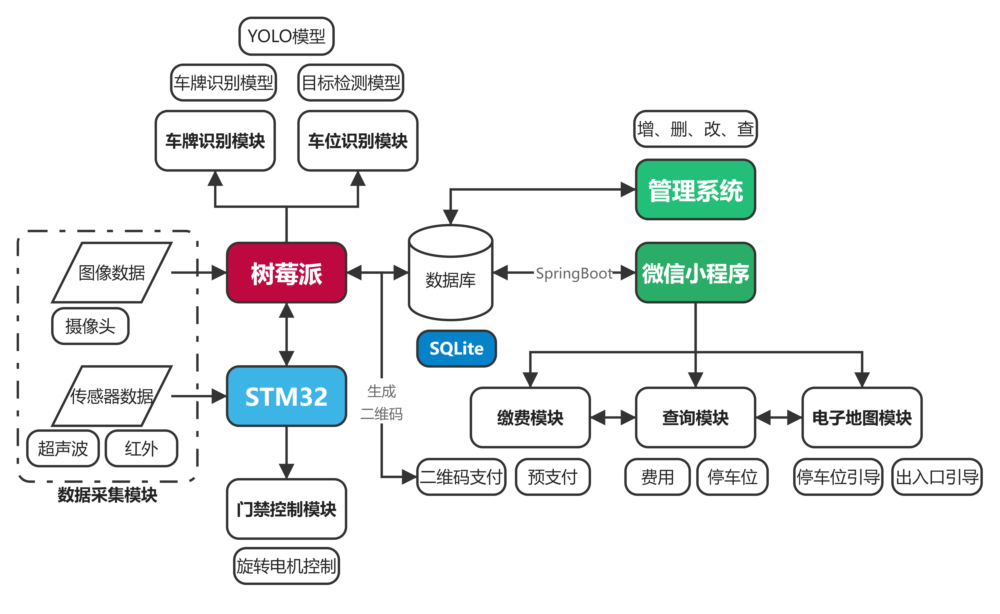

# 智能停车场管理系统开发（进阶版）

## 子模块

### 车牌识别子系统（@doing）

树莓派识别车辆车牌等信息，存入数据库。

参见文件夹 `Car_recognition`。

### 停车场管理子系统（since 2023.6）

Qt 5 Windows 桌面程序对停车场信息进行增删改查。

参见文件夹 `IPMS_system`。

### 车位检测子系统（@todo）

STM32 检测车位停放车辆情况，使用 MQTT 协议与服务器（树莓派）通信。

### 用户查询子系统（@todo）

微信小程序查询车位剩余情况（SpringBoot）、电子地图、出场缴费。

## 总系统流程

## 系统测试

